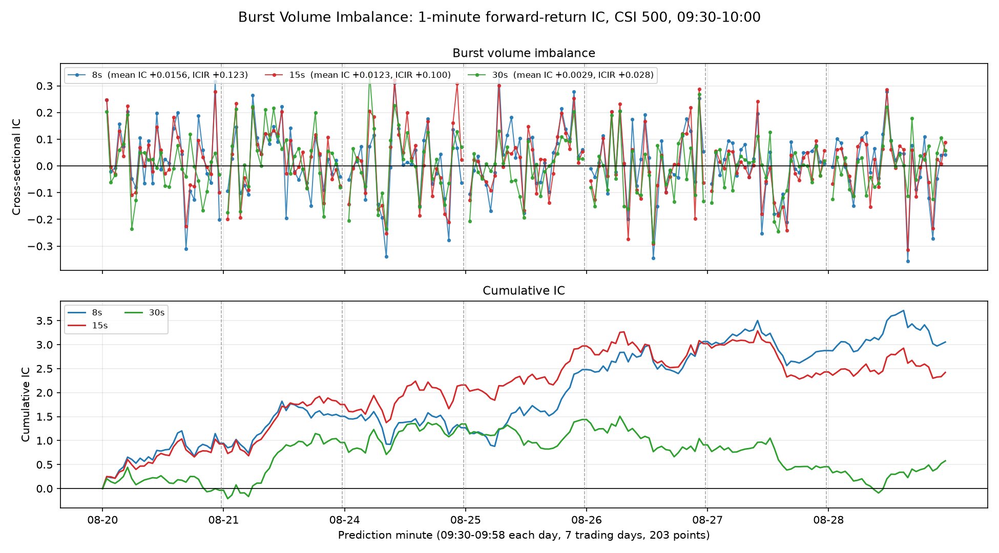
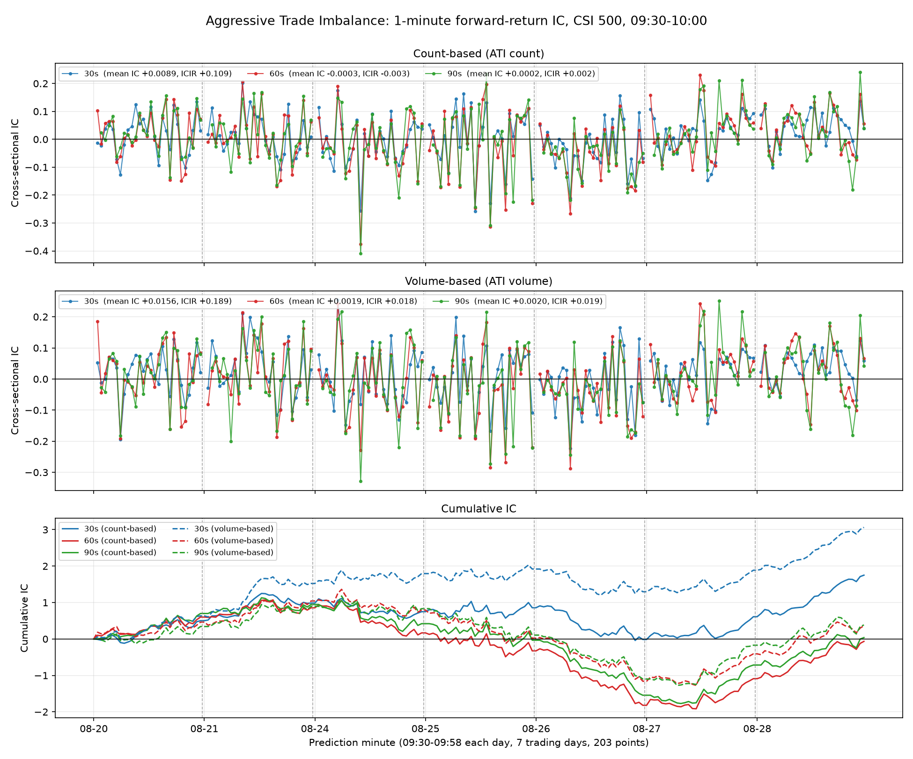
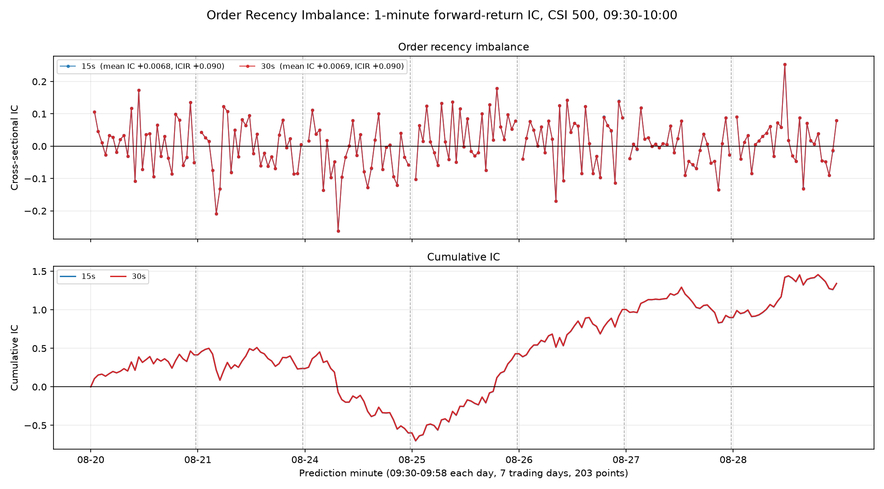

# intraday_alpha_1m

**A minimal, end-to-end high-frequency alpha research pipeline on China A-share Level-2 (order-book tick) data.**

This repository walks the full path from raw exchange message streams to an evaluated cross-sectional signal:

```text
raw Level-2 streams  ->  forward-return target  ->  order-flow factors  ->  cross-sectional IC
   (132M rows)            (203 x 500 matrix)        (11 factor matrices)     (per-minute IC + plots)
```

The study asks one question: **do order-flow imbalances measured over the last few seconds predict the next minute's
cross-sectional return among CSI 500 stocks?**

Three factor families are built from three different message streams — aggressive trade imbalance (trades),
order-arrival recency imbalance (orders), and burst volume imbalance (orders) — each over several lookback windows.
The strongest signals reach a mean cross-sectional IC of **+0.016** over the sample, with signal strength decaying
sharply as the lookback window lengthens, which is the expected behaviour for order-flow alpha at this horizon.

The emphasis of the project is **timing correctness**: at every prediction timestamp `t`, factors use strictly
pre-`t` information while the target return starts from the first quote at or after `t`, so factor and target never
overlap. See [Timing convention](#4-timing-convention-the-core-design-constraint).

> **Scope and honesty note.** The sample is 7 trading days x 30 minutes (203 prediction timestamps). This is a
> pipeline-and-methodology exercise, not a validated trading strategy. Only one of the eleven factor variants reaches
> a naive |t| > 2, and no transaction costs, capacity, or portfolio construction are modelled. See
> [Limitations](#10-limitations-and-next-steps).

---

## Table of contents

1. [What this project studies](#1-what-this-project-studies)
2. [Data](#2-data)
   - [2.1 Source and access](#21-source-and-access)
   - [2.2 The three streams](#22-the-three-streams)
   - [2.3 Universe, sample period, and intraday window](#23-universe-sample-period-and-intraday-window)
   - [2.4 Scale of the working sample](#24-scale-of-the-working-sample)
   - [2.5 Timestamp resolution and minimal time lag](#25-timestamp-resolution-and-minimal-time-lag)
   - [2.6 Venue asymmetries and data caveats](#26-venue-asymmetries-and-data-caveats)
3. [Prediction target](#3-prediction-target)
4. [Timing convention: the core design constraint](#4-timing-convention-the-core-design-constraint)
5. [Factors](#5-factors)
   - [5.1 Aggressive Trade Imbalance (ATI)](#51-aggressive-trade-imbalance-ati)
   - [5.2 Order Recency Imbalance](#52-order-recency-imbalance)
   - [5.3 Burst Volume Imbalance](#53-burst-volume-imbalance)
6. [Results](#6-results)
7. [Reproducing the pipeline](#7-reproducing-the-pipeline)
8. [Repository layout](#8-repository-layout)
9. [Data access and what is committed](#9-data-access-and-what-is-committed)
10. [Limitations and next steps](#10-limitations-and-next-steps)

---

## 1. What this project studies

Level-2 (tick-by-tick) data exposes the *process* that generates prices: every order submission, every cancellation,
every execution, with the exchange's own sequencing. The premise of short-horizon alpha research is that this process
carries information about the immediate future that is not yet in the price.

This project tests that premise in its simplest cross-sectional form:

- Fix a grid of one-minute prediction timestamps `t` inside the opening half hour.
- At each `t`, summarise the last few seconds of order flow for every CSI 500 stock into a single number
  (the **factor**) that is bounded in `[-1, 1]` and directionally interpretable (+1 = buy pressure, -1 = sell pressure).
- Measure the **target**: the stock's mid-price return over the following minute.
- Compute the **cross-sectional information coefficient (IC)**: the correlation, across ~480 stocks at a single
  timestamp, between the factor and the subsequent return.

An IC that is positive on average means the factor ranks stocks in the right order: the stocks with more buy-side
pressure right now tend to be the stocks that outperform over the next minute. Everything else in the pipeline —
the target construction, the alignment rules, the lookback logic — exists to make that number trustworthy.

Three complementary views of order flow are tested:

| Factor family | Stream used | Question it asks |
| --- | --- | --- |
| Aggressive Trade Imbalance | trades | Which side is *paying the spread* to get filled? |
| Order Recency Imbalance | orders | Which side placed a new order *most recently*? |
| Burst Volume Imbalance | orders | Which side is submitting *simultaneous clusters* of orders? |

The first measures realised aggression, the second measures freshness of intent, and the third targets a
microstructure artefact specific to this data: the 10 ms timestamp grid, on which algorithmic order submission shows
up as many orders sharing one exact timestamp.

---

## 2. Data

### 2.1 Source and access

All raw data come from the Hugging Face dataset
[`venvoo/china-a-share-l2-level2-limit-order-book-tick-data`](https://huggingface.co/datasets/venvoo/china-a-share-l2-level2-limit-order-book-tick-data),
an archive of Chinese securities Level-2 data spanning 2017-2026 (~555 billion rows / ~6.2 TB of Parquet across
2,346 trading days, uploaded in batches, so not every date is available yet).

**The dataset is gated.** It is publicly listed, but access is not automatic. To download it you must:

1. Click the **♥ Like** button on the dataset page;
2. **Request access** (a bot approves liked accounts, typically within minutes);
3. Authenticate locally with `hf auth login`.

The license is **`research-use-only`** — academic and non-commercial research. The license covers the compilation,
cleaning, and documentation of the archive, *not* ownership of the underlying market data, which remains with its
original rights holders. Consequently **no raw or derived market-data values are committed to this repository**; see
[Data access and what is committed](#9-data-access-and-what-is-committed).

Downloads in this project are pinned to dataset revision `0121dd0a60756d74efb23bf19a2876af3565ee3b` for
reproducibility.

### 2.2 The three streams

Each trading day is stored as three Parquet files. `src/download_data.py` slices the requested universe and time
window out of them and writes local copies as `quotes.parquet`, `orders.parquet`, `trades.parquet`.

**Quotes — `行情.parquet` (66 columns).** Ten-level order-book snapshots, roughly one snapshot every **3 seconds**
per symbol (median inter-snapshot gap 3,000 ms in this sample; occasional gaps are longer). Carries
`bid_px1..bid_px10` / `ask_px1..ask_px10` with matching volumes, last price, running high/low/open/prev_close, and
cumulative volume/turnover. Stock price fields are integers scaled by 10,000 (`price_CNY = price / 10000`). Used here
only to build the mid-price target.

**Orders — `逐笔委托.parquet` (10 columns).** One row per order message: `wind_code`, `date`, `time`, `order_id`,
`ex_order_id`, `order_type`, `order_code` (`B`/`S`), `price`, `volume`. This is the densest stream (~10.8M rows/day in
a 30-minute window) and is the input to two of the three factor families.

**Trades — `逐笔成交.parquet` (12 columns).** One row per execution, *plus* Shenzhen cancellation records.
`bs_flag` (`B`/`S`) gives the vendor's aggressor-side flag and is the basis of the Aggressive Trade Imbalance factor;
`ask_order_id` / `bid_order_id` link executions back to resting orders. Note that row count here is **not** the number
of executions, because Shenzhen cancellations live in this file (`trade_code = 'C'`, ~1.5M rows/day, `bs_flag` empty).

### 2.3 Universe, sample period, and intraday window

- **Universe:** a fixed CSI 500 constituent list as of 2026-08-20 — **500 Wind codes** (280 `.SH` / 220 `.SZ`), stored
  in `data/csi500_wind_codes_20260820.txt`. The universe is held fixed across all days: it is never re-derived per
  date, and the factor/target column order is exactly the file order, so nothing can silently reshuffle between runs.
  499 of 500 symbols have data on the first five days (`002155.SZ` has no rows, consistent with suspension) and
  500/500 on the last two.
- **Sample period:** 7 consecutive trading days, **2026-08-20 through 2026-08-28** —
  `20260820, 20260821, 20260824, 20260825, 20260826, 20260827, 20260828`.
- **Intraday window:** `09:30:00.000 <= time < 10:00:00.000` Asia/Shanghai — the opening half hour only, where
  intraday order-flow signal is strongest and message volume is highest. All downloads are cut to this window, which
  is why the very first prediction timestamp of each day has no usable lookback history (handled explicitly; see
  [Timing convention](#4-timing-convention-the-core-design-constraint)).

### 2.4 Scale of the working sample

7 days x 3 streams = 21 Parquet files, **132,098,040 rows**, **987.7 MiB** on disk:

| Stream | Rows (7 days) | Rows/day (avg) | Per stock/day (avg) |
| --- | ---: | ---: | ---: |
| Quotes | 2,085,096 | ~297,900 | ~600 snapshots |
| Orders | 75,709,658 | ~10,815,700 | ~21,700 messages |
| Trades | 54,303,286 | ~7,757,600 | ~15,500 records |
| **Total** | **132,098,040** | ~18,871,100 | |

Every file passes the integrity checks in `src/download_data.py` (row-copy match, schema match, date/time bounds,
universe containment); the full report is in `data/download_summary_20260820_20260828.txt`.

### 2.5 Timestamp resolution and minimal time lag

The raw `time` field is an integer in `HHMMSSmmm` format (`93500010` = `09:35:00.010`), so it must be zero-padded to
9 digits before parsing — `09:30:00.000` is stored as `93000000`, only 8 digits.

Measured on the order stream for 2026-08-20:

- every timestamp is an exact multiple of **10 ms** (0 rows violate `time % 10 == 0`);
- the **minimum non-zero gap between consecutive order events of the same stock is 10 ms**;
- a single day's 30-minute window contains exactly **180,000 distinct timestamps** = 30 min x 60 s x 100 ticks/s,
  i.e. the 10 ms grid is fully saturated.

**The feed's effective time resolution is therefore 10 ms, not microseconds.** This is a load-bearing fact for this
project rather than trivia. With ~10.8M order messages per day compressed onto 180,000 timestamp slots, *many
same-stock, same-side orders carry an identical timestamp*: on 2026-08-20, 10.25M qualifying (non-cancellation)
orders fall into 6.35M (stock, side, timestamp) clusters, and **~50% of all qualifying orders sit in a cluster of
2 or more** (up to 600 orders sharing one stock-side-timestamp).

Two consequences:

1. All window comparisons are done at full millisecond precision — timestamps are never rounded to seconds before
   deciding whether an event falls inside `[t-W, t)`.
2. Those simultaneous clusters are themselves a signal, which is exactly what the
   [Burst Volume Imbalance](#53-burst-volume-imbalance) factor measures. (`src/validate_orderid_assumption.py` is the
   scratch check confirming that `order_id` / `ex_order_id` cannot be used to group these events — Shenzhen
   `order_id` is frequently 0 — so burst detection is defined purely on stock + side + exact timestamp.)

### 2.6 Venue asymmetries and data caveats

Shanghai and Shenzhen encode the same concepts differently; `data/data_reference.txt` documents the full field and
category reference compiled for this project. The rules that matter here:

| Concept | Shanghai (SH) | Shenzhen (SZ) |
| --- | --- | --- |
| New order | `order_type = 'A'` | `order_type in ('0','2')` limit, `'1'` market, `'U'` own-side-best |
| Cancellation | order stream, `order_type = 'D'` | **trade** stream, `trade_code = 'C'` |
| Order semantics | messages may describe the remainder after fills | original submitted orders |

Other caveats respected by the code:

- **Never apply one cancellation rule to both venues.** Factors built on the order stream exclude `order_type = 'D'`
  (SH cancellations, ~1.69M of 11.94M rows on 2026-08-20) so that only genuine submissions are counted.
- **Do not trust the `.SH`/`.SZ` suffix as a venue identifier** — the dataset documentation warns some non-stock
  instruments carry misleading suffixes. This project sidesteps the issue by restricting everything to a
  date-appropriate CSI 500 stock list.
- **`ex_code` is a bare security code, not an exchange code.**
- **Price scaling (÷10,000) applies to price fields only**, not to `amount` or other derived fields. For returns the
  factor cancels out, so mid-prices are used on the raw scale.
- **IDs are sequence identifiers, not identities** — they do not identify an investor, account, or broker, and are not
  used as such anywhere in this repo.

---

## 3. Prediction target

`src/build_targets.py` builds the forward-return matrix that every factor is evaluated against.

**Mid-price.** From the top of book, valid only when both sides are quoted:

$$ mid_{i,\tau} = \frac{bidpx1_{i,\tau} + askpx1_{i,\tau}}{2}, \qquad \text{valid iff } bidpx1 > 0 \text{ and } askpx1 > 0 $$

**As-of-next price lookup.** For a boundary time `t`, the price is taken from the **earliest valid quote at or after
`t`** — never the last quote before `t`:

$$ P_i(t) = mid_{i,\tau^*}, \qquad \tau^* = \min\{\tau : \tau \ge t,\ \tau \le t + \delta,\ \text{quote valid}\} $$

with a configurable staleness tolerance `MAX_QUOTE_DELAY_SECONDS = 5`. If the first quote at or after `t` arrives more
than 5 seconds late, the price is `NaN` rather than stale. Since quotes arrive every ~3 seconds this rarely binds
(185 of 105,000 boundary lookups rejected for delay across the whole sample).

**Target.**

$$ y_{i,t} = \frac{P_i(t + h)}{P_i(t)} - 1 $$

with the horizon `h` set by the `HORIZON_MINUTES` constant (`h = 1` throughout this study).

**Valid prediction timestamps** are derived from the horizon and the available window rather than hard-coded: within a
30-minute window there are `30 - h` usable timestamps per day, so `h = 1` gives 09:30 ... 09:58 (29/day, **203 rows**
over 7 days) and `h = 5` would give 09:30 ... 09:54 (25/day, 175 rows) with no change to the target logic. A 09:59
target cannot exist because it would require a quote at or after 10:00, which is outside the downloaded window.

**Output:** `data/target_return_1min.pkl`, a **203 x 500** DataFrame (rows = prediction datetime, columns = the
universe file order), 0.60% `NaN`. This file is the *canonical template*: every factor matrix is required to match its
index and columns exactly, element for element.

---

## 4. Timing convention: the core design constraint

The single most important property of this pipeline is that a factor at time `t` cannot see anything the target at
time `t` depends on.

```text
          factor information                         target measurement
     |<------ [t - W, t) ------>|                |<------ h = 1 minute ------>|
-----+--------------------------+----------------+----------------------------+-----
   t - W                        t          first valid quote            first valid quote
                          (prediction time)      >= t                      >= t + h
                                            (within 5s)                  (within 5s)
```

- **Factor side:** every event used satisfies `t - W <= event_time < t`. The upper bound is *strict* — an order or
  trade stamped exactly at `t` is excluded.
- **Target side:** the return starts at the first valid quote with timestamp `>= t`.

These two intervals are disjoint by construction, so no information used to build a factor can have influenced the
price at which the target return begins.

**Incomplete-history rule.** Because the raw data begin at 09:30:00, a lookback window that would extend before the
session start is not merely empty — it is *unavailable*. Whenever `t < 09:30 + W`, the **entire factor row across all
500 stocks is set to `NaN`** rather than being computed from a partial window. This is derived from the configured
window length, not hard-coded per timestamp. For example:

| Prediction time | 8s / 15s / 30s windows | 60s window | 90s window |
| --- | --- | --- | --- |
| 09:30 | `NaN` (row) | `NaN` (row) | `NaN` (row) |
| 09:31 | available | available (exactly `[09:30:00, 09:31:00)`) | `NaN` (row) |
| 09:32+ | available | available | available |

This is why the 90-second ATI factors have ~7% `NaN` against ~3.6% for the 30-second ones, and why every factor's
09:30 row is entirely missing.

---

## 5. Factors

All three families produce a bounded, sign-interpretable score:

$$ \text{factor} \in [-1, 1], \qquad +1 = \text{pure buy-side pressure}, \quad 0 = \text{balanced}, \quad -1 = \text{pure sell-side pressure} $$

A shared convention separates "balanced" from "no information": a **zero denominator yields `NaN`, never 0**. A value
of 0 means buy and sell pressure genuinely offset; `NaN` means there was no qualifying activity in the window at all.
Missing values are never filled with zero, and factors are deliberately left raw — no winsorization, standardization,
or neutralization — so the first-stage evaluation reflects the signal itself.

### 5.1 Aggressive Trade Imbalance (ATI)

*Stream: trades. Script: `src/build_ati_factors.py`. Windows: 30s / 60s / 90s.*

**Idea.** A trade's `bs_flag` marks which side crossed the spread to get filled. A participant willing to pay the
spread is revealing urgency, and urgency is informative: if buyers have been the aggressors over the last 30 seconds,
the stock is more likely to keep drifting up over the next minute. Counting *trades* and summing *volume* answer
slightly different questions — many small aggressive buys (retail/algo slicing) versus a few large ones — so both are
built.

Using only rows with `bs_flag in {'B','S'}` in `[t-W, t)`:

$$ ATI^{count}_{i,t,W} = \frac{N^B_{i,t,W} - N^S_{i,t,W}}{N^B_{i,t,W} + N^S_{i,t,W}}, \qquad
   ATI^{volume}_{i,t,W} = \frac{V^B_{i,t,W} - V^S_{i,t,W}}{V^B_{i,t,W} + V^S_{i,t,W}} $$

where `N` is the number of aggressive trades and `V` is their summed volume on each side.

**Outputs:** `ati_count_{30,60,90}s`, `ati_volume_{30,60,90}s` (6 matrices).

### 5.2 Order Recency Imbalance

*Stream: orders. Script: `src/build_order_recency_factors.py`. Windows: 15s / 30s.*

**Idea.** Rather than *how much* has been submitted, ask *how recently*. The side that placed the most recent new
order is the side currently showing intent. This is a pure timing signal: it is insensitive to order size and to the
overall activity level of the stock, which makes it behave very differently from the volume-weighted factors, and it
responds instantly to a change in who is leaning on the book.

Over non-cancellation orders (`order_type != 'D'`) in `[t-W, t)`, define the age of the most recent order on each side,
capped at the window length when that side is silent:

$$ Age^{B}_{i,t,W} = \begin{cases} t - \max\{\tau \in [t-W, t) : \text{buy order}\} & \text{if any} \\ W & \text{otherwise} \end{cases} $$

(and symmetrically for `Age^S`), then

$$ RecencyImbalance_{i,t,W} = \frac{Age^{S}_{i,t,W} - Age^{B}_{i,t,W}}{Age^{S}_{i,t,W} + Age^{B}_{i,t,W}} $$

A fresher buy order (small `Age^B`) pushes the factor positive. If one side is entirely silent, its age saturates at
`W` and the factor moves strongly toward the active side; if both are silent, both ages equal `W` and the factor is a
legitimate 0.

**Outputs:** `order_recency_imbalance_{15,30}s` (2 matrices).

### 5.3 Burst Volume Imbalance

*Stream: orders. Script: `src/build_burst_volume_factors.py`. Windows: 8s / 15s / 30s.*

**Idea.** This factor exploits the 10 ms timestamp grid described in
[section 2.5](#25-timestamp-resolution-and-minimal-time-lag). When a single participant slices a parent order, or when
several algorithms react to the same tick, the resulting child orders land on the *same stock, same side, same 10 ms
stamp*. Isolated orders are ordinary flow; simultaneous clusters are a fingerprint of coordinated, machine-driven
intent — and the volume inside those clusters is a cleaner measure of institutional pressure than total order volume,
which is dominated by background noise.

A **burst** is any (stock, side, exact timestamp) group containing at least 2 qualifying orders
(`order_type != 'D'`, `order_code in {'B','S'}`), and its volume is the sum over the whole group:

$$ BV^{B}_{i,t,W} = \sum_{\tau \in [t-W,\,t)} \mathbb{1}\{N^B_{i,\tau} \ge 2\} \sum_{j \in B(i,\tau)} Volume_j $$

(and symmetrically for `BV^S`), giving

$$ BurstVolumeImbalance_{i,t,W} = \frac{BV^{B}_{i,t,W} - BV^{S}_{i,t,W}}{BV^{B}_{i,t,W} + BV^{S}_{i,t,W}} $$

Orders that do not belong to a burst contribute nothing. Buy and sell bursts are detected independently, and no
attempt is made to infer whether a burst came from a single trader. Across the 7 days the detector finds
**3.81M buy bursts and 3.84M sell bursts**.

Because this factor deliberately discards non-burst flow, it is the sparsest of the three: at an 8-second window
26.5% of cells are `NaN` (no burst on either side), versus 8.2% at 30 seconds.

**Outputs:** `burst_volume_imbalance_{8,15,30}s` (3 matrices).

---

## 6. Results

Evaluation is a per-timestamp cross-sectional correlation between the factor and the next-minute return, computed on
the ~480 stocks where both values are present (`src/plot_ic.py`, with `src/eval_ic.py` as a single-factor helper):

$$ IC_t = \mathrm{corr}_i\big(f_{i,t},\ y_{i,t}\big), \qquad ICIR = \frac{\mathrm{mean}(IC_t)}{\mathrm{std}(IC_t)}, \qquad t\text{-stat} = ICIR \sqrt{n} $$

Full report: [`results/ic_summary.txt`](results/ic_summary.txt) · raw series: [`results/ic_timeseries.csv`](results/ic_timeseries.csv)

| Factor | Window | n IC | mean IC | std IC | ICIR | t-stat | % IC>0 | mean RankIC | avg stocks |
| --- | --- | ---: | ---: | ---: | ---: | ---: | ---: | ---: | ---: |
| `ati_volume_30s` | 30s | 196 | **+0.0156** | 0.0826 | +0.189 | **+2.65** | 60.2 | +0.0078 | 479.6 |
| `burst_volume_imbalance_8s` | 8s | 196 | **+0.0156** | 0.1264 | +0.123 | +1.73 | 56.1 | **+0.0182** | 366.6 |
| `burst_volume_imbalance_15s` | 15s | 196 | +0.0123 | 0.1234 | +0.100 | +1.40 | 54.6 | +0.0142 | 419.2 |
| `ati_count_30s` | 30s | 196 | +0.0089 | 0.0821 | +0.109 | +1.52 | 59.7 | +0.0003 | 479.6 |
| `order_recency_imbalance_30s` | 30s | 196 | +0.0069 | 0.0761 | +0.090 | +1.26 | 56.6 | +0.0086 | 479.8 |
| `order_recency_imbalance_15s` | 15s | 196 | +0.0068 | 0.0761 | +0.090 | +1.26 | 56.6 | +0.0085 | 479.8 |
| `burst_volume_imbalance_30s` | 30s | 196 | +0.0029 | 0.1072 | +0.028 | +0.39 | 55.1 | +0.0025 | 457.5 |
| `ati_volume_90s` | 90s | 189 | +0.0020 | 0.1068 | +0.019 | +0.26 | 49.2 | -0.0061 | 462.6 |
| `ati_volume_60s` | 60s | 196 | +0.0019 | 0.1013 | +0.018 | +0.26 | 52.0 | -0.0076 | 479.8 |
| `ati_count_90s` | 90s | 189 | +0.0002 | 0.1026 | +0.002 | +0.03 | 51.3 | -0.0090 | 462.6 |
| `ati_count_60s` | 60s | 196 | -0.0003 | 0.1001 | -0.003 | -0.05 | 51.5 | -0.0111 | 479.8 |

### Reading the results

**1. Every meaningful signal is positive.** Buy-side pressure — whoever is paying the spread, submitting most
recently, or bursting hardest — precedes higher relative returns over the next minute. This is short-horizon
order-flow momentum and the sign is consistent across all three independently constructed families.

**2. Signal decays sharply with lookback length.** This is the clearest pattern in the study:

| Family | Shortest window | Middle | Longest |
| --- | --- | --- | --- |
| ATI (volume) | **+0.0156** (30s) | +0.0019 (60s) | +0.0020 (90s) |
| Burst volume | **+0.0156** (8s) | +0.0123 (15s) | +0.0029 (30s) |

Information in order flow has a half-life measured in *seconds*. Averaging over a longer window mostly adds stale
flow, which dilutes the signal — the 60s and 90s ATI variants are statistically indistinguishable from zero. The
burst family, which can be pushed to a much shorter 8-second window because clusters are dense, decays along the same
curve. This also suggests the best windows tested here are still too long rather than too short.

**3. Trade aggression and burst clustering carry different information.** `ati_volume_30s` has the highest t-stat but
a weak rank IC (+0.0078), meaning its edge is concentrated in the extreme, large-imbalance names. `burst_volume_imbalance_8s`
has the same mean IC with the *highest* rank IC (+0.0182), i.e. a more uniform edge across the cross-section — despite
scoring only ~367 of 500 stocks, since it ignores everything that is not a burst. The two rank stocks quite
differently (mean per-minute cross-sectional rank correlation of only **0.19**), so they are complementary rather
than redundant.

**4. Order recency is the most stable but weakest.** Both windows give a near-identical +0.0069 with the lowest IC
volatility (std 0.076) and 56.6% positive minutes. Because it only reads the timestamp of the single most recent order
per side, the 15s and 30s variants almost always see the same event for liquid stocks — they differ only for sparsely
traded names.

**5. Statistical significance is thin, as expected at this sample size.** Only `ati_volume_30s` clears a naive
|t| > 2, and that t-statistic assumes 196 independent observations, which minute-spaced ICs within the same session
are not. Treat the table as a consistent set of effect *signs and magnitudes*, not as proof of significance.

### IC time series

Each figure shows the per-minute IC (203 prediction timestamps across the 7 days, dashed lines mark day boundaries)
with one colour per lookback window, above the cumulative IC.

**Burst Volume Imbalance** — the 8s and 15s windows accumulate steadily; the 30s window flattens out early:



**Aggressive Trade Imbalance** — count-based on top, volume-based in the middle. The separation in the cumulative
panel between the 30s variants and the 60s/90s variants is the decay effect described above:



**Order Recency Imbalance** — the two windows track each other almost exactly:



Note the scale on the top panels: single-minute ICs swing between -0.41 and +0.35. A mean IC of +0.016 is a
very small edge riding on very large noise — which is what alpha at this horizon looks like, and why the cumulative
panel (a steady upward drift punctuated by multi-day drawdowns) is the more honest picture.

---

## 7. Reproducing the pipeline

**Prerequisites:** Python 3.12+, a Hugging Face account with access to the dataset
([see 2.1](#21-source-and-access)), and ~1 GB of free disk per week of data.

```bash
python -m venv .venv && source .venv/bin/activate
pip install duckdb pandas numpy pyarrow huggingface_hub matplotlib

hf auth login                      # required: the dataset is gated
```

Run from the repository root, in order:

```bash
python src/download_data.py              # 1. download + verify the 21 raw Parquet files (~988 MiB)
python src/build_targets.py              # 2. data/target_return_1min.pkl            (203 x 500)
python src/build_ati_factors.py          # 3. 6 ATI factor matrices                  (~2 min)
python src/build_order_recency_factors.py # 4. 2 order-recency factor matrices       (~2 min)
python src/build_burst_volume_factors.py # 5. 3 burst-volume factor matrices         (~2 min)
python src/plot_ic.py                    # 6. results/ic_summary.txt + 3 IC figures
```

Every build script prints its own sanity-check block (shape, index/column equality against the target, `NaN` share,
value range, distributional stats, early-window behaviour) and asserts the alignment contract before writing.

**Configuration.** Each script exposes its parameters as constants at the top — `HORIZON_MINUTES` and
`MAX_QUOTE_DELAY_SECONDS` in `build_targets.py`, `WINDOW_SECONDS` in each factor script, `MIN_BURST_ORDERS` in the
burst script. Changing a horizon or adding a window requires no change to the underlying logic.

**Performance.** Each order/trade factor script processes ~50-75M rows in roughly two minutes on a laptop. Parquet is
read through DuckDB with the universe filter and category filters pushed into SQL; per stock and side, event
timestamps are sorted once per day and reduced to prefix sums, so a window aggregate is two `np.searchsorted` lookups
and a subtraction. Nothing loops over individual raw order rows, and no daily frame is rescanned per
(stock x timestamp x window).

---

## 8. Repository layout

```text
intraday_alpha_1m/
├── README.md
├── LICENSE                               # covers the code in this repo, not the source data
├── src/
│   ├── download_data.py                  # HF download, window/universe slicing, integrity report
│   ├── inspect_sample.py                 # one-day schema/category exploration (writes data/inspect_sample_*.txt)
│   ├── validate_orderid_assumption.py    # ad-hoc check: order_id is unusable for grouping simultaneous orders
│   ├── build_targets.py                  # forward-return target (configurable horizon + quote-delay tolerance)
│   ├── build_ati_factors.py              # Aggressive Trade Imbalance      (count/volume x 30/60/90s)
│   ├── build_order_recency_factors.py    # Order Recency Imbalance         (15/30s)
│   ├── build_burst_volume_factors.py     # Burst Volume Imbalance          (8/15/30s)
│   ├── eval_ic.py                        # single-factor IC helper
│   └── plot_ic.py                        # all-factor IC report + figures -> results/
├── results/
│   ├── ic_summary.txt                    # IC / RankIC / ICIR / t-stat table for all 11 factors
│   ├── ic_timeseries.csv                 # the 203 x 11 per-minute IC matrix
│   ├── ic_burst_volume_imbalance.png
│   ├── ic_ati.png
│   └── ic_order_recency_imbalance.png
└── data/                                 # mostly gitignored - see below
    ├── csi500_wind_codes_20260820.txt    # tracked: the fixed 500-name universe
    ├── data_reference.txt                # tracked: field + category reference compiled for this project
    ├── download_summary_20260820_20260828.txt  # tracked: row counts and integrity checks
    ├── raw/YYYYMMDD/{quotes,orders,trades}.parquet   # NOT tracked
    ├── target_return_1min.pkl                        # NOT tracked
    └── factors/*.pkl                                 # NOT tracked
```

---

## 9. Data access and what is committed

The source archive is licensed **research-use-only**, and that license explicitly covers the compilation rather than
the underlying market data, whose rights remain with their owners. This repository therefore contains **no market-data
values of any kind** — the `.gitignore` excludes:

- `data/raw/` and all `*.parquet` — the raw quote/order/trade streams;
- `data/*.pkl` and `data/factors/` — the target and factor matrices, which are per-stock, per-minute values *derived*
  from the licensed data and are treated the same way;
- `data/inspect_sample_*.txt` — exploration dumps that embed verbatim quote/order/trade rows;
- DuckDB scratch files and caches.

What *is* tracked is limited to code and aggregate research output: the scripts, the IC statistics and figures in
`results/` (cross-sectional correlations aggregated over ~480 stocks, from which no individual stock's prices or
volumes can be recovered), the CSI 500 ticker list, the schema reference notes, and the download integrity report
(row counts and pass/fail checks, no data rows).

To reproduce: request access to the dataset, run `hf auth login`, then run the pipeline in
[section 7](#7-reproducing-the-pipeline). Every raw file is re-downloadable from the pinned revision
`0121dd0a60756d74efb23bf19a2876af3565ee3b`.

---

## 10. Limitations 

**Limitations.**

- **Sample size.** 7 trading days and 203 prediction timestamps, all from a single week and a single 30-minute
  session. Nothing here is validated out-of-sample, across regimes, or across time of day.
- **Significance.** Per-minute ICs within a session are not independent, so the reported t-statistics are optimistic;
  only one factor variant would clear |t| > 2 even on the naive assumption.
- **Opening half-hour only.** 09:30-10:00 is the most active and least representative part of the session; these
  results should not be extrapolated to midday or the close.
- **No trading realism.** No transaction costs, no bid-ask spread crossing, no capacity or turnover constraint, no
  position limits. IC is a necessary condition for a tradable signal, not a sufficient one.
- **Raw factors only.** Deliberately no winsorization, standardization, industry/size neutralization, or missing-value
  imputation — so part of the measured IC may reflect sector or liquidity tilts rather than pure order-flow alpha.

<!-- **Natural next steps.**

1. **Extend the sample** to several months and the full trading session, then re-estimate with day-level block
   bootstrapping instead of naive t-statistics.
2. **Push to shorter windows.** The decay pattern implies the optimum is below the shortest window tested; a 2-5s
   burst window and a sub-30s ATI window are the obvious next experiments, along with an exponentially weighted
   decay instead of a hard cutoff.
3. **Neutralize and winsorize**, then re-measure, to separate order-flow alpha from sector/size/liquidity exposure.
4. **Combine the families.** `ati_volume_30s` and `burst_volume_imbalance_8s` have equal mean IC but very different
   rank IC and coverage, which suggests a simple equal-weight or IC-weighted composite would beat either alone.
5. **Add book-state factors** from the ten-level quote snapshots (depth imbalance, weighted mid, book slope) as a
   different information channel from message flow.
6. **Move from IC to a portfolio simulation** — quantile long/short spreads, turnover, and cost sensitivity — to see
   whether an IC of this size survives contact with the spread. -->
