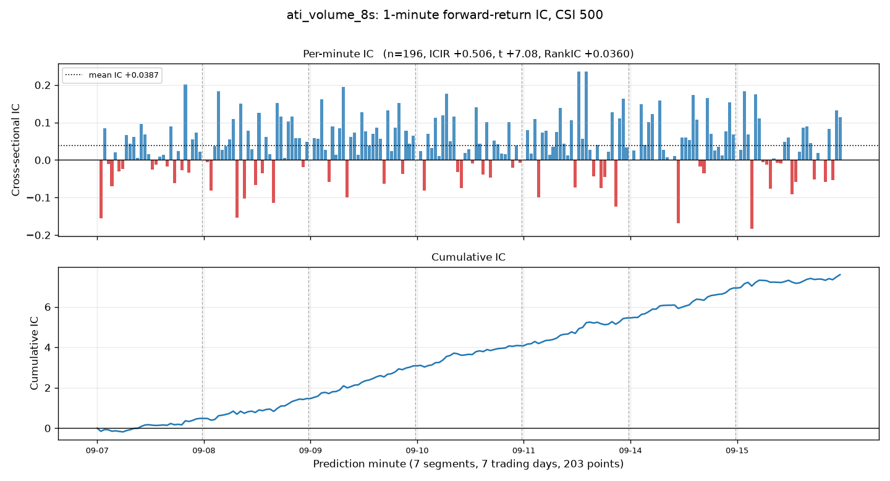
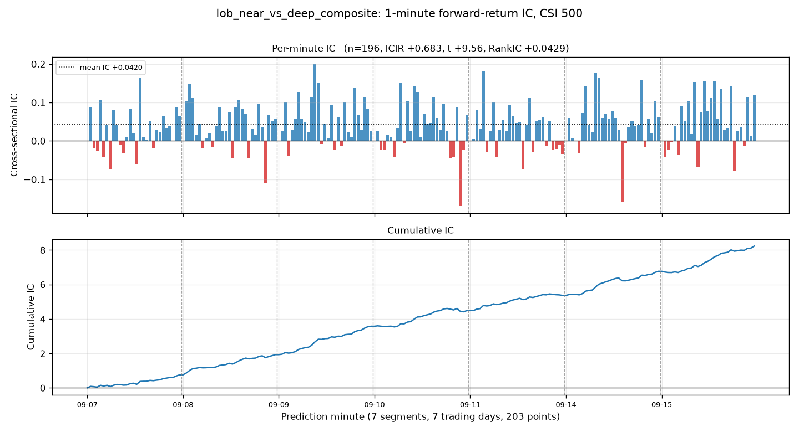
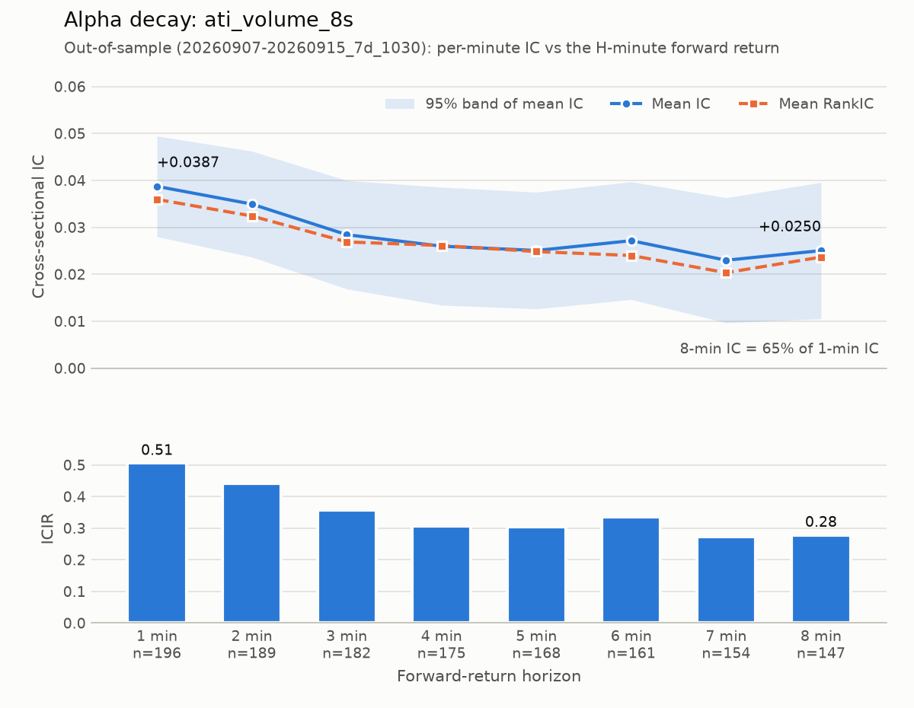
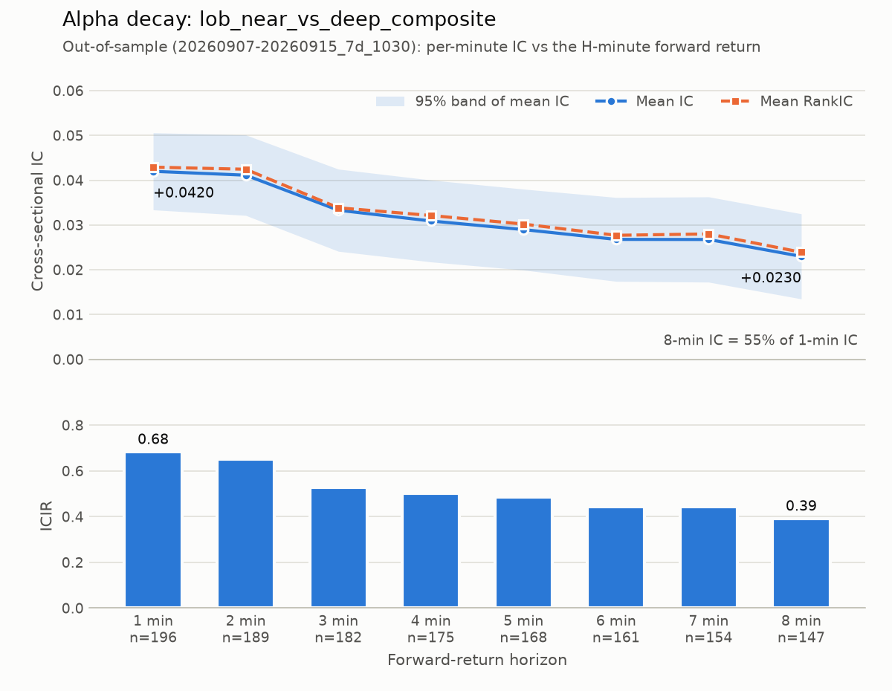

# intraday_alpha_1m

A structured pipeline for high-frequency alpha factors on China A-share Level-2 data. It goes from raw exchange
message streams to a forward-return target, factor matrices built directly from the raw data, and a cross-sectional IC
evaluation.

- **Data:** 10-level quotes, orders and trades, with a 10 ms tick time tag.
  - In-sample: 2026-08-20 to 2026-08-28, 09:30–10:00.
  - Out-of-sample: 2026-09-07 to 2026-09-15, 10:30–11:00.
- **Universe:** CSI 500 (a fixed list of 500 stocks).
- **Target:** the next 1-minute mid-price return. At each minute `t`, factors use only information from before `t`,
  and the return starts from the first quote at or after `t`, so factor and target never overlap.

## Data

The raw data comes from the Hugging Face dataset
[`venvoo/china-a-share-l2-level2-limit-order-book-tick-data`](https://huggingface.co/datasets/venvoo/china-a-share-l2-level2-limit-order-book-tick-data).
It is a gated, research-use-only archive of Chinese Level-2 data, so no market data is committed to this repo.
Each trading day has three streams:

| Stream | Content |
| --- | --- |
| Quotes | 10-level order-book snapshots, about one every 3 s per stock |
| Orders | one row per order message (side, price, volume) |
| Trades | one row per execution, with the aggressor side flag |

| Sample | Days | Window | Rows | Size |
| --- | ---: | --- | ---: | ---: |
| In-sample | 7 | 09:30–10:00 | 132.1M | 988 MiB |
| Out-of-sample | 7 | 10:30–11:00 | 44.1M | 383 MiB |

Timestamps are stored as `HHMMSSmmm`, but the feed's effective resolution is **10 ms**. Every event falls on a 10 ms
grid, and many same-stock, same-side orders share one exact timestamp.

## Factors

Each factor is a stock × minute matrix. IC is the cross-sectional Pearson correlation between the factor and the
next-minute return, computed at each minute across roughly 420–480 stocks. Results below are **out-of-sample**:
7 days × 10:30–10:58, 203 timestamps.

### 1. Aggressive Trade Imbalance (ATI)

A trade's aggressor flag shows which side paid the spread to get filled. Sustained aggressive buying signals urgency
that tends to carry into the next minute. The volume version uses aggressive trades in the trailing window
`[t - W, t)`:

$$ ATI_{i,t,W} = \frac{V^{B}_{i,t,W} - V^{S}_{i,t,W}}{V^{B}_{i,t,W} + V^{S}_{i,t,W}}, \qquad W \in \{4, 8, 15, 30\}\ \text{s} $$

| Factor | n | mean IC | ICIR | t-stat | % IC > 0 | RankIC |
| --- | ---: | ---: | ---: | ---: | ---: | ---: |
| `ati_volume_8s` | 196 | **+0.0387** | 0.506 | 7.08 | 73.0 | +0.0360 |

### 2. Queuing Imbalance

Depth imbalance `(B - A) / (B + A)` means opposite things at different levels of the book. Depth at the best
bid/ask predicts the next move in the same direction, while depth deeper in the book (levels 6–10) predicts the
reverse. The composite z-scores both across stocks at each minute and takes their difference:

$$ F_{i,t} = Z\big(\text{imbalance}_{L1,\ 3s}\big)_{i,t} - Z\big(\text{imbalance}_{L6\text{–}10,\ 30s}\big)_{i,t} $$

| Factor | n | mean IC | ICIR | t-stat | % IC > 0 | RankIC |
| --- | ---: | ---: | ---: | ---: | ---: | ---: |
| `lob_near_vs_deep_composite` | 196 | **+0.0420** | 0.683 | 9.56 | 77.0 | +0.0429 |

## Alpha decay

Both factors are re-evaluated against 1- to 8-minute forward returns on the same out-of-sample days (10:30 start,
window 30 − H minutes so that `t + H` stays inside the data). The shaded band is the 95% interval of the mean IC;
bands overlap between neighbouring horizons, so read the trend, not single steps.

- **ATI (8s):** IC falls from +0.039 to about +0.026 by 4 minutes, then levels off (8-min IC is 65% of 1-min IC).
  Most of the aggression signal is priced in within a few minutes.
- **Queuing imbalance:** IC decays steadily, from +0.042 to +0.023 (55% retained).

